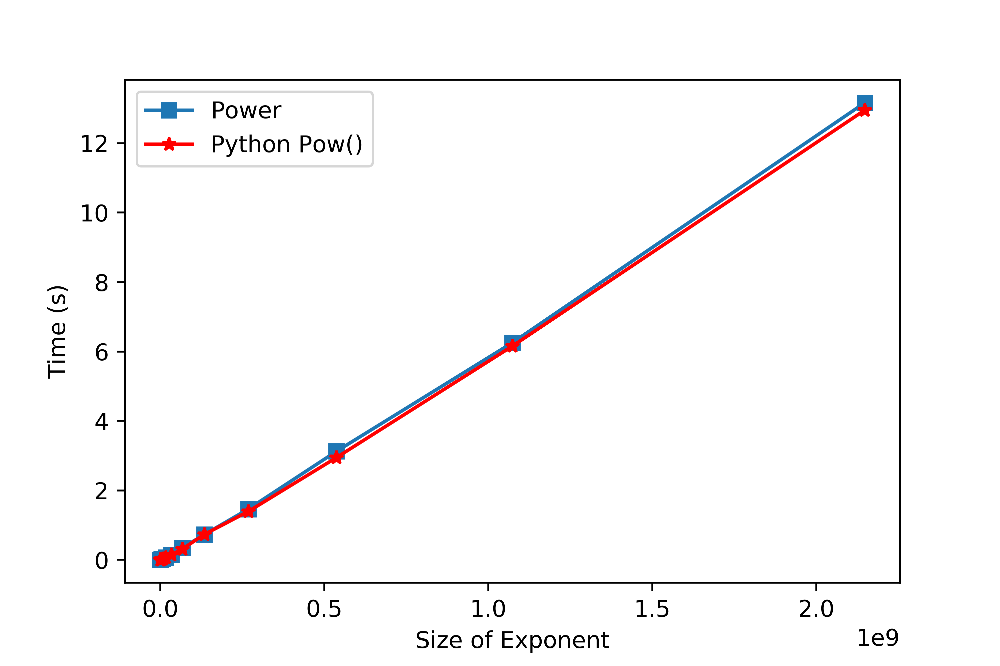

# Exponentiation
Implementation of exponentiation by squaring recursively.

Base and exponent could be positive or negative floats.

See how growth in size of the exponent "x" (2 x ) affects the performance of the function. 
.png)

Comparison of written code and built-in Python pow function by changing size of the exponent.

